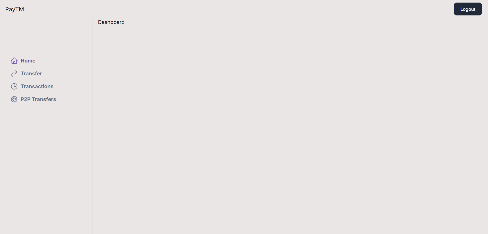
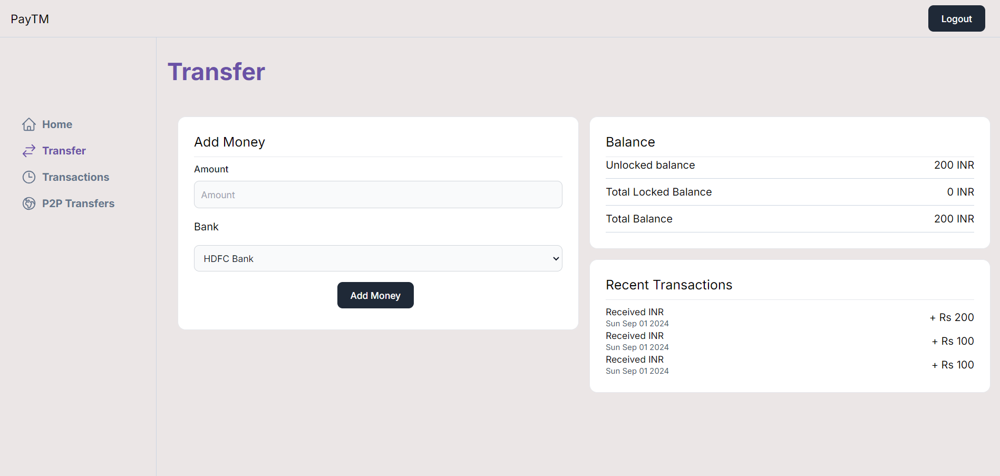
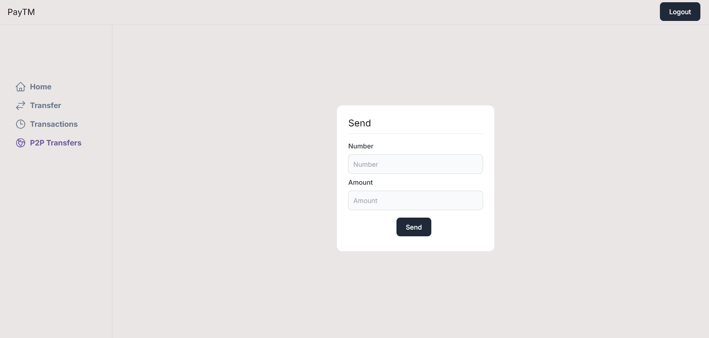

- npm install
- Run postgres either locally or on a cloud provider like neon.tech

```jsx
docker run  -e POSTGRES_PASSWORD=mysecretpassword -d -p 5432:5432 postgres
```

- Copy over all .env.example files to .env
- Update .env files everywhere with the right db url
- Go to `packages/db`
    - npx prisma migrate dev
    - npx prisma db seed
- Go to `apps/user-app` , run `npm run dev`
- Try logging in using phone if on the same wifi network - 1111111111 , password - alice (See `seed.ts`)

The app has a login page, that redirects to the home page, which is a dashboard by default.



There is a bank webhook emulated which should be run after going to `apps/bank-webhook` and running `npm run dev`.



You could also send money to other users present in the db, with the amount being deducted from your balance.

